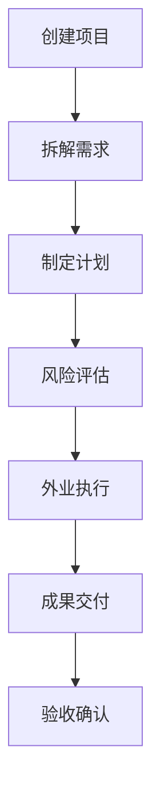

## 1. 产品概述
飞行任务协同 Web 系统服务于测绘公司，支持从任务报价到外业执行的全过程管理，提升团队协作效率和项目交付质量。

## 2. 核心功能

### 2.1 用户角色
| 角色 | 注册方式 | 核心权限 |
|------|----------|----------|
| 项目经理 | 后台创建 | 全功能访问，项目管理，审批权限 |
| 外业人员 | 后台创建 | 查看项目，上传外业数据 |
| 客户 | 邮箱注册 | 查看项目进度，提交验收意见 |

### 2.2 功能模块
1. **项目列表页**: 客户管理、区域管理、预算管理、交付日期维护
2. **需求页**: 航摄任务拆解、建模任务拆解、巡查任务拆解、子任务分配
3. **计划页**: 飞行批次安排、人员调度、设备管理、备用日期规划
4. **风险页**: 空域限制登记、天气窗口监控、起降点条件检查
5. **外业页**: 飞行记录上传、照片管理、轨迹记录、问题上报
6. **交付页**: 成果文件管理、验收意见收集、补拍安排、进度汇总

### 2.3 页面详情
| 页面名称 | 模块名称 | 功能描述 |
|----------|----------|----------|
| 项目列表页 | 项目管理 | 项目列表展示、新增/编辑/删除项目、客户信息维护、区域选择、预算设置、交付日期管理 |
| 项目列表页 | 筛选搜索 | 按客户/区域/状态筛选、关键词搜索、分页展示 |
| 需求页 | 任务拆解 | 航摄任务、建模任务、巡查任务的创建与编辑 |
| 需求页 | 任务分配 | 子任务分配给团队成员、设置优先级 |
| 计划页 | 批次安排 | 创建飞行批次、设置时间窗口、分配负责人 |
| 计划页 | 资源调度 | 人员排班、设备分配、备用日期设置 |
| 风险页 | 风险登记 | 空域限制记录、天气条件监控、起降点状态 |
| 风险页 | 预警管理 | 风险等级评估、预警规则设置 |
| 外业页 | 数据上传 | 飞行记录上传、照片批量上传、轨迹文件导入 |
| 外业页 | 问题上报 | 现场问题描述、位置标记、严重程度选择 |
| 交付页 | 成果管理 | 成果文件上传、版本管理、下载权限控制 |
| 交付页 | 验收流程 | 验收意见收集、补拍任务安排、签字确认 |
| 交付页 | 进度汇总 | 项目进度可视化、完成率统计、时间线展示 |

## 3. 核心流程

## 4. 用户界面设计

### 4.1 设计风格
- **主色调**: 深蓝色系 (#1e3a5f) 配合活力橙色 (#f97316) 作为强调色
- **按钮风格**: 圆角矩形，hover 时有轻微放大效果
- **字体**: 标题使用 Inter Bold，正文使用 Inter Regular
- **布局风格**: 卡片式布局，左侧导航，右侧内容区
- **图标风格**: 使用 lucide-react 图标库

### 4.2 页面设计概览
| 页面名称 | 模块名称 | UI 元素 |
|----------|----------|---------|
| 项目列表页 | 项目卡片 | 卡片式布局、悬停阴影效果、状态标签 |
| 项目列表页 | 搜索筛选 | 顶部搜索栏、下拉筛选器、状态标签 |
| 需求页 | 任务表单 | 分步表单、进度条、表单验证提示 |
| 计划页 | 日历视图 | 周视图/月视图切换、日程块拖拽 |
| 风险页 | 风险看板 | 优先级色块、状态标签、操作按钮组 |
| 外业页 | 文件上传 | 拖拽上传区域、进度指示器、预览缩略图 |
| 交付页 | 进度面板 | 环形进度条、统计卡片、时间线组件 |

### 4.3 响应式设计
- **桌面端**: 左侧固定导航栏，右侧内容区自适应
- **平板端**: 可折叠导航栏，内容区单列布局
- **移动端**: 底部导航栏，卡片堆叠展示

### 4.4 交互体验
- 页面切换平滑过渡动画
- 表单实时验证反馈
- 列表项悬停高亮效果
- 按钮点击涟漪效果
