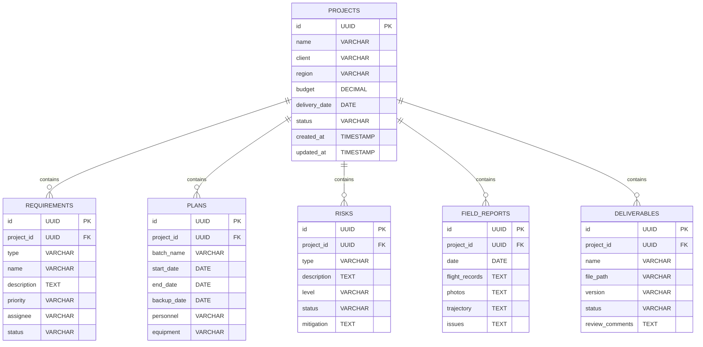

## 1. 架构设计

```mermaid
layeredGraph LR
    subgraph Frontend[前端]
        React[React 18]
        Router[React Router]
        Store[Zustand]
        UI[TailwindCSS]
    end
    
    subgraph Backend[后端]
        Express[Express 4]
        API[RESTful API]
    end
    
    subgraph Data[数据层]
        DB[(PostgreSQL)]
        Storage[(文件存储)]
    end
    
    React --> API
    API --> DB
    API --> Storage
```

## 2. 技术描述
- **前端**: React@18 + TypeScript + TailwindCSS@3 + Vite
- **路由**: React Router DOM@6
- **状态管理**: Zustand
- **图标**: lucide-react
- **后端**: Express@4 + TypeScript
- **数据库**: PostgreSQL
- **文件存储**: 本地文件系统（生产环境可扩展为云存储）

## 3. 路由定义
| 路由 | 页面组件 | 功能描述 |
|------|----------|----------|
| / | ProjectList | 项目列表首页 |
| /projects/:id | ProjectDetail | 项目详情（需求/计划/风险/外业/交付切换） |
| /projects/:id/requirements | Requirements | 需求拆解页 |
| /projects/:id/planning | Planning | 计划安排页 |
| /projects/:id/risk | Risk | 风险登记页 |
| /projects/:id/field | Field | 外业执行页 |
| /projects/:id/delivery | Delivery | 交付管理页 |

## 4. API 定义

### 4.1 项目 API
| 方法 | 路径 | 描述 |
|------|------|------|
| GET | /api/projects | 获取项目列表 |
| POST | /api/projects | 创建新项目 |
| GET | /api/projects/:id | 获取项目详情 |
| PUT | /api/projects/:id | 更新项目信息 |
| DELETE | /api/projects/:id | 删除项目 |

### 4.2 需求 API
| 方法 | 路径 | 描述 |
|------|------|------|
| GET | /api/projects/:id/requirements | 获取项目需求列表 |
| POST | /api/projects/:id/requirements | 创建需求项 |
| PUT | /api/requirements/:id | 更新需求项 |
| DELETE | /api/requirements/:id | 删除需求项 |

### 4.3 计划 API
| 方法 | 路径 | 描述 |
|------|------|------|
| GET | /api/projects/:id/plans | 获取项目计划列表 |
| POST | /api/projects/:id/plans | 创建计划项 |
| PUT | /api/plans/:id | 更新计划项 |
| DELETE | /api/plans/:id | 删除计划项 |

### 4.4 风险 API
| 方法 | 路径 | 描述 |
|------|------|------|
| GET | /api/projects/:id/risks | 获取项目风险列表 |
| POST | /api/projects/:id/risks | 创建风险项 |
| PUT | /api/risks/:id | 更新风险项 |
| DELETE | /api/risks/:id | 删除风险项 |

### 4.5 外业 API
| 方法 | 路径 | 描述 |
|------|------|------|
| GET | /api/projects/:id/field-reports | 获取外业报告列表 |
| POST | /api/projects/:id/field-reports | 创建外业报告 |
| POST | /api/field-reports/:id/upload | 上传附件 |

### 4.6 交付 API
| 方法 | 路径 | 描述 |
|------|------|------|
| GET | /api/projects/:id/deliverables | 获取交付物列表 |
| POST | /api/projects/:id/deliverables | 上传交付物 |
| PUT | /api/deliverables/:id | 更新交付物状态 |

## 5. 服务器架构


## 6. 数据模型

### 6.1 ER 图



### 6.2 DDL 语句

```sql
CREATE TABLE projects (
    id UUID PRIMARY KEY DEFAULT uuid_generate_v4(),
    name VARCHAR(255) NOT NULL,
    client VARCHAR(255),
    region VARCHAR(255),
    budget DECIMAL(10, 2),
    delivery_date DATE,
    status VARCHAR(50) DEFAULT 'pending',
    created_at TIMESTAMP DEFAULT CURRENT_TIMESTAMP,
    updated_at TIMESTAMP DEFAULT CURRENT_TIMESTAMP
);

CREATE TABLE requirements (
    id UUID PRIMARY KEY DEFAULT uuid_generate_v4(),
    project_id UUID REFERENCES projects(id),
    type VARCHAR(50),
    name VARCHAR(255),
    description TEXT,
    priority VARCHAR(50),
    assignee VARCHAR(255),
    status VARCHAR(50) DEFAULT 'pending'
);

CREATE TABLE plans (
    id UUID PRIMARY KEY DEFAULT uuid_generate_v4(),
    project_id UUID REFERENCES projects(id),
    batch_name VARCHAR(255),
    start_date DATE,
    end_date DATE,
    backup_date DATE,
    personnel VARCHAR(255),
    equipment VARCHAR(255)
);

CREATE TABLE risks (
    id UUID PRIMARY KEY DEFAULT uuid_generate_v4(),
    project_id UUID REFERENCES projects(id),
    type VARCHAR(50),
    description TEXT,
    level VARCHAR(50),
    status VARCHAR(50) DEFAULT 'active',
    mitigation TEXT
);

CREATE TABLE field_reports (
    id UUID PRIMARY KEY DEFAULT uuid_generate_v4(),
    project_id UUID REFERENCES projects(id),
    date DATE,
    flight_records TEXT,
    photos TEXT,
    trajectory TEXT,
    issues TEXT
);

CREATE TABLE deliverables (
    id UUID PRIMARY KEY DEFAULT uuid_generate_v4(),
    project_id UUID REFERENCES projects(id),
    name VARCHAR(255),
    file_path VARCHAR(500),
    version VARCHAR(50),
    status VARCHAR(50) DEFAULT 'pending',
    review_comments TEXT
);
```
